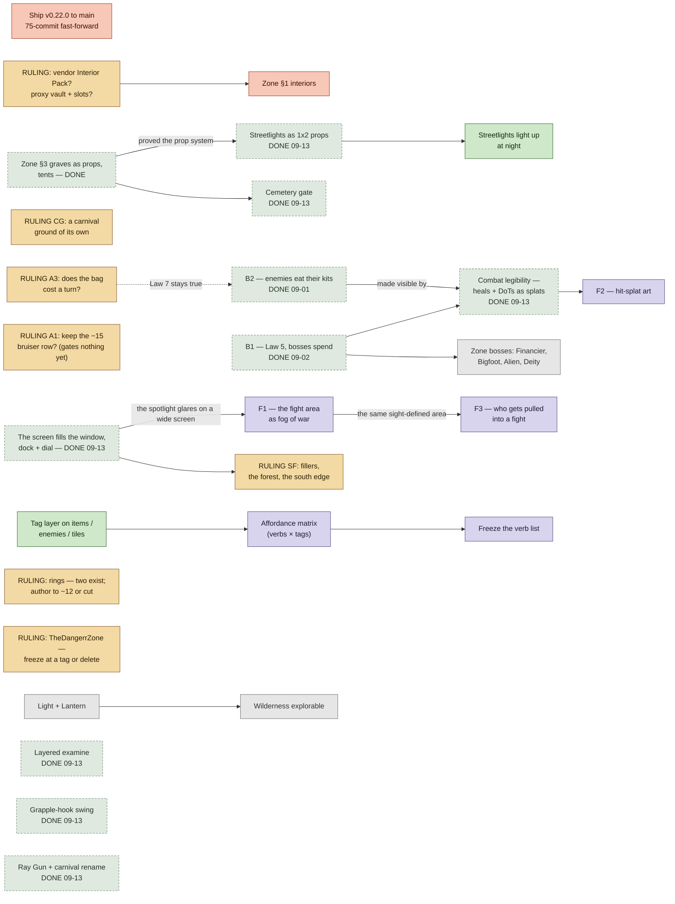

# Roadmap — September 2026

**Compiled 2026-09-07, at the close of the visual/animation/zone-identity sessions.** This is the
**entry point** for picking up work. It consolidates and *verifies against `dev`* every open item
from: `plan:plans/next-session-open-work.md` (2026-07-25), `plan:plans/undeveloped-backlog.md`
(2026-07-23), `plans/systems-audit-2026-08.md` §7, `plans/demo-readiness.md` §2, ROADMAP.md's
pending decisions, and the three passes that landed this week.

> **Why this exists (Caelan, 2026-09-07):** *"my lack of visibility into what we're working on next
> makes it hard for me to visualize what features and plans build on each other. Most of this is in
> my head."* So this document's job is the **dependency graph**, not the list. The lanes below are
> ordered by what unblocks what.

> **Supersedes** `next-session-open-work.md` and `undeveloped-backlog.md` as the starting point.
> Both were accurate when written; **seven of their items have since shipped** and are listed in
> §6 so nobody re-does them. The `plan` branch itself is six weeks stale — see §5.

**State right now (updated 2026-09-13):** `main` @ `38a44c2` (v0.21.0), **75 commits behind `dev`,
deliberately** — nothing since v0.21.0 is on the live site. Suite 1333 / 245 / 0 failures.
**Merged to `dev` on 2026-09-13:** `feature/combat-legibility`, `feature/ready-builds` (five builds
and the see-through tile fix), and `feature/screen-fill` — the game fills the window, the world
carries on past every map's edge, and the wheel sits on a dial in a bottom dock. All in §6. Next in
Caelan's queue: F1–F3 (§4), the three pieces his 09-11 notes opened after the screen.

> **Audited against the code 2026-09-10 — eight rows were wrong.** The 09-07 compile carried items
> over from the July backlogs without re-checking them, and some had shipped the week before:
> **B2 and B1 were already built** (`0922928`, `6bdb7ad`), **A4 was already answered**, **A1 gates
> nothing** in today's roster, and **R's "five rings" was never true** (there are two, and one
> fusion). All corrected below; the audit's method was grep + `git log -S` per row. Before building
> from this document, spend one grep confirming the row is still open.

---

## 0. The dependency graph

Read this before the lanes. An arrow means "left must land before right is buildable."

Three things the graph makes visible that the lists did not:

1. **The boss line's mechanism is built; what is left of it is content.** Law 5 runs (`6bdb7ad`),
   the Wererat and the Borgir boss carry an authored `boss` flag and lint clean as elite. The four
   zone bosses are unblocked authoring work, not engineering. *(This bullet said the opposite on
   09-07 — "two rulings gate the entire boss line." Both rulings' premises had already shipped.)*
2. **The rulings that still gate a build are the zone ones:** Z1/Z2 → interiors, CG → a carnival
   ground. A1 and A3 gate nothing buildable today.
3. **The zone-identity work and the combat work do not touch each other.** They can proceed in
   parallel sessions without file collisions — zone work lives in `sprites.js` / map JSON, combat
   work in `npc.js` / `combat.js` / `enemies.js`.

---

## 1. NOW — in flight on `dev`

| Item | State | Size | Doc | Blocked by |
|---|---|---|---|---|
| **Ship v0.22.0 to `main`** | Caelan's call; deliberately held. A clean fast-forward (75 commits on 2026-09-13) + version bump in 3 files + annotated tag. The demo-readiness doc's own headline: *"nothing else is worth as much."* Before shipping, re-time a frame at 3440×1440 on a quiet machine — the last re-time ran under an outside GPU load (`plans/screen-fill.md`, *Measured*). | S | `plans/demo-readiness.md` §0 | nothing |
| **Zone §1 — interiors get a vocabulary** | Blocked on two rulings (§2). Floors already solved via `rlOutlined_packed.png`. **No interior wall exists in any bundled sheet.** | M | `plans/zone-identity.md` §1 | Z1, Z2 |

---

## 2. RULINGS CAELAN OWES — cheap, and each one gates something

Ordered by how much each unblocks.

| # | Ruling | What it gates | Source |
|---|---|---|---|
| **A1** | **Keep the −15 `bruiser` row?** It exists — `tools/balance-harness.mjs:146`, 15–40 GP, interpolated between fodder and standard and marked an open question. **No enemy in any map sits in its band** (armor −30 < a ≤ −15), and Pike is armor 5, which the `tough` row covers. Confirm it, or fold −15 into a neighbour, before anyone authors a −15 enemy. *(Corrected 2026-09-10: this row used to say the band had no row and gated "the entire boss line".)* | Nothing today | `next-session-open-work` A1 |
| **A3** | **Does opening the REMOTICON cost a world turn?** Load-bearing now DoTs are live — a bag-open would cost a poison tick, undoing Law 7's "reading your bag is free." Proposed (systems-audit §6): *free out of combat, costed in combat.* Still open: `_openDevice` advances no turn. | Whether Law 7 is true | A3 |
| **A2** | **Poison-flip direction.** The downward mirror of the ally-flip was chosen, not derived. Confirm or replace. | Nothing to build; a correctness question | A2 |
| **Z1** | **Vendor `Roguelike Interior Pack`?** CC0, same pattern as RPG Urban, and *the only source anywhere with a counter.* | Zone §1 interiors | `zone-identity` §1 |
| **Z2** | **No slot machine or vault door exists in any pack.** Ship a boxy-cabinet proxy, or leave them text-only? (A cabinet-as-vault is the same class of compromise as the hooded-figure-as-rat.) | Zone §1 interiors | `zone-identity` §1 |
| **CG** | **The carnival's ground is Town's road** — `CIRCUS_GROUND` and `ROAD` draw the same cell, over 892 of the carnival's 1,276 cells. Pick a ground of its own (from a cell no other tile draws), or accept the share in writing. Found 2026-09-10; the new shared-cell test carries it as the one open exception. | Zone identity's bar for the carnival | `zone-identity` §3 findings |
| **B3** | **Cone of Cold** — 1.40 dmg/MP against a 1.50 floor. **Still the lone balance-lint flag** (re-verified 2026-09-07). Retune or widen the band; a permanent flag trains everyone to ignore the lint. | Lint credibility | B3 |
| **R** | **Rings: author to ~12, or cut.** **Two exist** (`rat_ring`, `fire_ring`) and one fusion — `game/ring-data.js`, and what systems-audit §3.1 itself says. *(Corrected 2026-09-10: this row said five.)* | Whether the ring system is a feature or a fossil | systems-audit §3.1 |
| **DZ** | **TheDangerrZone — freeze at a tag or delete.** Eight `*-TheDangerrZone.*` files still ship in `game/`, unreachable from `index.html`. | Repo clarity | systems-audit §3.3 |
| **D1** | **`feature/diagonal-prototype`** — 568 commits behind dev (2026-09-13, and rising); its diff *deletes* rings, xmb, the balance harness. Delete, or label as archive. | Branch hygiene | D1 |
| **P1** | **Phone tap targets render at half their designed size** — nothing on the canvas clears Apple's 44pt. *(Updated 2026-09-13: the screen-fill rule — at least 20 tiles on the short side — draws a phone at 0.5×, down from 0.62×: a tile is 16 CSS px, the dock's ✦ 36 px. The page's ☰ and ▤ are 44 px now.)* Options: fewer tiles on narrow screens / a touch layout / accept phone as secondary. *A design decision, not a bug.* | Mobile demo viability | `demo-readiness` §2.1 |
| **P2** | **"End of Chapter One" does not exist.** `_endChapterOne()` is called from nowhere; the bridge drops you into Chapter Two. Delete the orphan, or give the demo a curtain. | Demo has a stopping point | `demo-readiness` §2.2 |
| **V1** | **Theft-aiming volume** — aiming a theft puts all nine town cones back. Correct information, possibly too much. Scope to the theft's range if so. | Feel | `visual-pass.md` |
| **V2** | **`Lire` has no lion.** Allowlisted unsprited rather than given a bad pick. | One sprite | `visual-pass.md` |
| **AU** | **Audio discoverability.** Ships muted (ruled, correctly). Nobody discovers audio exists. Wants a visible speaker glyph — *not* autoplay. | Demo polish | `demo-readiness` §2.3 |
| **SF** | **Screen-fill's open calls.** (1) The filler for each zone — the table in `plans/screen-fill.md`, pinned by `tests/tile-coverage.test.js`, so change both. (2) The forest is one tree on every cell: accept it, or vary it (a second prop, a hash). (3) Filler trees are two tiles tall and join the depth sort, so the row past a map's south edge covers its last row: you vanish for the one step onto Town's south exit, and two Carnival corner cells hide what stands on them. Accept, or draw fillers behind everything. | How the world's edge looks | `plans/screen-fill.md` |

---

## 3. READY TO BUILD — design settled, a plan exists

| Item | Size | Blocked by | Doc | Where the doc lives |
|---|---|---|---|---|
| **T1 — Tag layer** on items / enemies / tiles | M | nothing | Not built. Prerequisite for the affordance matrix. | systems-audit §5.4 |
| **C1 — seven unreachable `Escape` branches** | S | nothing | Shadowed by `_closeCurrentMenu`'s switch, which handles Escape first (`main.js` ~1095–1254 vs ~1837–1850). *(Corrected 2026-09-10: `ITEM_THROW_DIR` is not dead — it is entered at ~2716 and handled for keyboard and tap.)* | C1 |
| **C3 — input asymmetries** | M | nothing | REMOTICON item/gear/ring actions are pointer-only; aiming, turn-in-place and the 1–9 hotbar are keyboard-only. Documented honestly; still gaps. | C3 |
| **C4 — `mystery_meat` can't heal on the throw path** | S | nothing | `combatAttack`'s `Math.max(1, raw − armor)` clamps a would-be heal to 1 damage. Cheapest fix: make it a 1-turn health poition instead of flat damage. | C4 |
| **Housekeeping** | S | nothing | Prune two stale worktrees (`great-wing`, `objective-volhard`, both clean at v0.19.0); 43 local branches whose remotes are `gone` (counted 2026-09-10). Migrate or archive the 24 `plan`-only docs (§5). | this doc |
| **RESTART keeps the last run's pickups** | S | nothing | `_fullReset` resets HP, bag, gear, gold, quests and the RNG — but not `_collectedItems` or `_droppedItems`, so after a restart everything the previous run picked up stays gone until the page reloads (verified live 2026-09-10 with the Ray Gun). Audit every per-run field the constructor sets against `_fullReset`, not only these two. | `main.js` `_fullReset` |
| **Streetlights light up at night** | S | nothing | Town's four lamps are props now, but Town's `lights` list has no entry at any of them — after dusk they are dark posts. One `lights` row each. | `town-map.json` `lights` |

---

## 4. NEEDS A DESIGN PASS before it is buildable

| Item | Open questions | Size | Doc | Blocked by |
|---|---|---|---|---|
| **F1 — the fight area as fog of war** | Next in Caelan's queue (09-11). Today's fight reads as a spotlight: a lit circle of radius ~4 tiles when an enemy is 2 tiles away, the world outside cut to about a third of its brightness, a black vignette on top — and on a filled screen the circle is a small share of the view. Direction: keep HAZE's polarity through the fight — clear where the fight can see, a light dither beyond that thins out rather than going dark. A tile-aligned square is the simpler alternative. Which vision defines the area — the player's, the fighters', both? | M | `plans/screen-fill.md` *Follow-on pieces* 1 | nothing |
| **F2 — hit-splat art** | Kenney's Emote Pack Style 8 glyphs (heart, drop, cross, star) cover heal, poison, miss and crit; no Kenney pack has a flame, snowflake or skull, so those get drawn. Which glyph per damage type, and on the splat or beside it? | S | `plans/screen-fill.md` *Follow-on pieces* 2 | nothing |
| **F3 — who gets pulled into a fight** | Possibly F1's sight-defined area as a gameplay rule: whoever can see the fight is in it. Decide F1's area first. | M | `plans/screen-fill.md` *Follow-on pieces* 3 | F1 |
| **Affordance matrix** — verbs (~20 wheel leaves) × tags | The discipline: *a blank cell is a decision, not an oversight.* Second job is diagnostic — a proposed element with zero edges is caught at design time. Needs the tag layer first. | M | systems-audit §9 | T1 |
| **Directional frames for every NPC, retire the chevron** | Violencians face their travel now. Extending to guards makes the overlay's facing chevron redundant — the stealth read becomes native to the art. Needs the other rpgUrban rows assigned. | M | `animation-pass.md` §4 | nothing |
| **"The Crat"** — sewer diplomacy talk-quest | How ambiguous the tell is; father-flip vs. "you are not the mother"; player as arbiter vs. bribeable; reward. Reconcile with the shipped sewer canon first. | M | `sewer-crat-quest.md` (**plan only**) | nothing |
| **Bestiary** — Cave + Weredigo (invisibility / blind-combat boss), Park + Ruffian (steal-and-flee via `transferGold` + `fleeStep`), Bear (friendly quest-giver), content enemies | Special mechanics? Which Kenney cells? Ruffian cleanly reuses two shipped systems and is the best first piece. | S–M each | `bestiary.md` (**plan only**) | nothing |
| **Elemental coverage matrix** | `fire` and `poison` joined `sludge` / `cold` / `energy` / `fear` with no weakness table to sit in. | S | E | nothing |
| **5-Zone Body reconciliation** | Survives as the positional layer (Back = backstab ×1.5), not split HP pools. Needs a ruling before the bible states it as law. | S | E | nothing |
| **Weapons have no art** | No weapon has ground or bag art: all five draw as lettered boxes — the Ray Gun a teal Z, the Wooden Sword a grey `?`. tinyDungeon has swords, axes and hammers; nothing bundled looks like a ray gun. Which cells — and what does the Ray Gun look like? | S–M | `sprites.js` `ITEM_SPRITES` | nothing |

---

## 5. POST-1.0 — big threads, scoped, none started

| Thread | One line | Size | Blocked by |
|---|---|---|---|
| **Zone deep content / bosses** | Financier (Street — a literal `dialogue.js` placeholder), Bigfoot (Carnival), Alien Invasion (Factory — where the Ray Gun should ultimately drop), The Deity (Graveyard). Its dependency, B1's boss mechanism, **shipped 2026-09-02** — so this is authoring work now, not engineering. | L, zone by zone | B1 |
| **Element meters** | Per-zone accumulating meters (Boredom / Fun / Goo / Death). Only Sludge exists, as a hazard DoT. | M | nothing |
| **Light + Lantern** | A purchasable light from Puck that makes the dark Wilderness explorable. `_drawDarkness` exists; no item. | S–M | nothing |
| **Party / creature recruitment** | Wererat / Clown / Robot / Skeleton as party members. Only the ally-flip primitive and the Lire summon exist. | M–L | nothing |
| **Gold-economy depth** | Gold Card tiers, gold-as-liability, travel tolls, an early time-boxed debt. GP is a pill today. | M | nothing |
| **Trade Slice 2** | Drag-to-swap barter, NPC loadouts, NPC gold. | M | nothing |
| **Enemy buys YOUR gear** / **AI reads your wallet** | Law 6 open hook; bribe demands scaling to visible wealth. *Very Violencetown.* Deferred, not rejected. | M | nothing |

**The `plan` branch problem.** 24 plan docs exist *only* on `plan`, which is six weeks stale and
badly diverged from `dev`. Three of the "ready to build" items above have their only spec there.
CLAUDE.md's rule is that active work lives on `dev`; parked work on `plan`. **Anything in §3 or §4
should have its doc migrated to `dev` before work starts** — `git show plan:plans/<file>` and commit.

**ROADMAP.md's seven ABC decisions** are listed as pending and are mostly *de facto settled by
shipped code* (turn-based movement, REMOTICON inventory, 32px scale). ROADMAP.md itself has not been
updated since 2026-04-01 and should be, or retired in favour of this document.

---

## 6. DONE — do NOT re-implement

Verified against `dev` @ `13c61ea` on 2026-09-07. All of these appear as *open* in at least one
parked document.

| Parked as open in | Item | Shipped as |
|---|---|---|
| `next-session-open-work` C2 | No modifier-key guard | `ctrlKey`/`metaKey` are checked in `game/` |
| " D2 | Naming gate false positive | Exclusion is in CLAUDE.md's documented command |
| " D3 | "CLAUDE.md says MP is inert" | Reads "MP is live" |
| systems-audit §7.1 | Fix fight length | `feature/fight-length` merged |
| systems-audit §7.6 | Place the first `puzzleWall` | `Sludge Bloom`, `sewer-map.json` |
| demo-readiness §2.4 | The depth was invisible | `hints.js` — situational one-shots, paced |
| demo-readiness §2.3 | Autoplay | Ruled: ships muted. Do not flip without asking. |
| `undeveloped-backlog` §4 | Everything in that section | Still accurate — wheel overhauls, movement-feel, world-structure, road-to-1.0 all built |
| this week | Threat overlay always-on; canvas fractional resampling; 9 red-box NPCs; rats as hooded figures; townsfolk as the player; ASCII awareness pips; lockstep idle bob; `reduceMotion` ignored by the bob; Sewer/Factory sharing cells; tile placement unguarded | `visual-pass.md`, `animation-pass.md`, `zone-identity.md` §0/§2/§4 |
| roadmap §1 | Zone §3 — graveyard graves as props, circus tents | 2026-09-10: 96 grave props in family plots, 86 real tents; placed props now guarded (`d1f286c` · `d981bd2`) |
| roadmap §3 | Zone §2 residual | 2026-09-10: boss floor off Factory's cell; no two tiles may share a cell unwritten (`d044b8e`) |
| found 2026-09-10 | Every zone's off-map margin drew Sewer's wall brick (since `13c61ea`) | `_drawTiles` paints the void off the map again (`3378bb0`) |
| roadmap §3 (stale) | B2 — enemies eat their own kits | **Already shipped when this roadmap was compiled:** `0922928`, 2026-09-01. A hurt enemy eats before it buys or swings, never double-doses, and the kit leaves the nameplate. Re-verified live 2026-09-10 |
| roadmap §3 (stale) | B1 — first real boss, Law 5 executes | **Already shipped:** `6bdb7ad`, 2026-09-02 — a boss buys its own HP and funds its worst-off ally; the Wererat and the Borgir boss carry `boss: true` and lint as elite |
| roadmap §2 (stale) | A4 — boss band derivation | **Answered in code:** `boss` is an authored flag (`6bdb7ad`), and `d7e1cd2` (2026-09-02) added Law 4's `tough` row, so the Wererat no longer lints as standard |
| roadmap §1 | Combat legibility — merge `feature/combat-legibility` | Merged 2026-09-13 (`7a3312b`): heals log "(+N HP)", every DoT tick floats its typed splat, and an enemy healing itself floats a green `+N` |
| roadmap §1 | Layered examine | Merged 2026-09-13 with `feature/ready-builds` (`689f26b`): one resolver behind E and the Target List — examine never dead-ends |
| roadmap §1 | Grapple-hook swing | Merged 2026-09-13 (`689f26b`): the canyon climb-out swings you up and out, on an arc, into Downtown |
| roadmap §1 | Ray Gun pickup + carnival rename | Merged 2026-09-13 (`689f26b`): the Ray Gun in the Factory's northwest bay; `carnival-map.json` with old saves migrated; the Wooden Sword re-equips |
| roadmap §1 | Streetlights as 1×2 props | Merged 2026-09-13 (`689f26b`). Still dark at night — §3 |
| roadmap §1 | Prop anchor + cemetery gate | Merged 2026-09-13 (`689f26b`): a stone gateway in each opening of the graveyard fence |
| found 2026-09-10 | See-through tiles flickered black and white at dusk | `b72a63a`, merged 2026-09-13: every see-through tile declares what is under it, and a PNG-alpha test keeps it so |
| Caelan, 2026-09-11 | The screen fills the window | `5278f33`, 2026-09-13 (`plans/screen-fill.md`): one viewport, tile size by one rule, a filler past every map's edge, the bottom dock and the wheel's dial. Fixed on the way: FIRE hidden under the wheel's pointer; the offer screen's mouse wheel |
| roadmap §2 | V3 — Canvas rung spacing | Resolved by the screen fill (`5278f33`): the backing store follows the window at whole-pixel scales, so no window loses a rung |
| roadmap §4 | Canvas adaptive backing store | Built as the screen fill (`5278f33`): `game/viewport.js` |

---

## 7. Suggested next three sessions

Not a mandate — a reading of the graph.

1. **Rulings session, then ship.** Z1–Z2 and CG gate builds; SF and P1 are the new screen's; A1,
   A2, A3, R, DZ, D1 are cheap and clear the board. None needs code. Then re-time a frame on a
   quiet machine and ship v0.22.0 — the demo is 75 commits stale, and the filled screen, the visual
   pass and this week's builds are all invisible until it moves.
2. **F1 — the fight area as fog of war** (Caelan's queue, 09-11). A design pass first: which vision
   defines the area, and dither or square. F3 then builds on F1's area; F2, the splat art, is small
   and stands alone.
3. **Small unblocked builds.** Streetlights light up at night, RESTART keeps the last run's pickups,
   C4 (mystery meat on the throw path). Then §1 interiors once Z1/Z2 are ruled, and a carnival
   ground once CG is. *(Earlier drafts of this list: B2 and B1 had already shipped; combat
   legibility and the zone-§3 follow-ons merged 2026-09-13.)*

Sessions 2 and 3 barely overlap: F1 lives in the renderer's fight passes; the small builds live in
map JSON, `_fullReset` and the item code.
